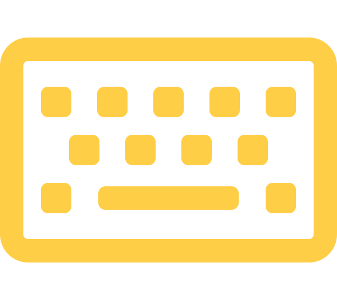

  

  
  
   
  
  
   
  

## Purpose

Execute the program by the command from the input parameter coming from the chrome extension app, and send the response
to it.

## 🤔 How to do it?

Use the [Native messaging host](https://developer.chrome.com/docs/apps/nativeMessaging/#native-messaging-host) to
communicate the native program

## Reference

- [Start an external application from a Google Chrome Extension?](https://stackoverflow.com/a/69188382/9935654)
- [GoogleChrome/chrome-extensions-samples](https://github.com/GoogleChrome/chrome-extensions-samples/tree/475b4b6/mv2-archive/api/nativeMessaging/host)
- [jfarleyx/chrome-native-messaging-golang](https://github.com/jfarleyx/chrome-native-messaging-golang/blob/95c4d57/native-host/src/main.go)
